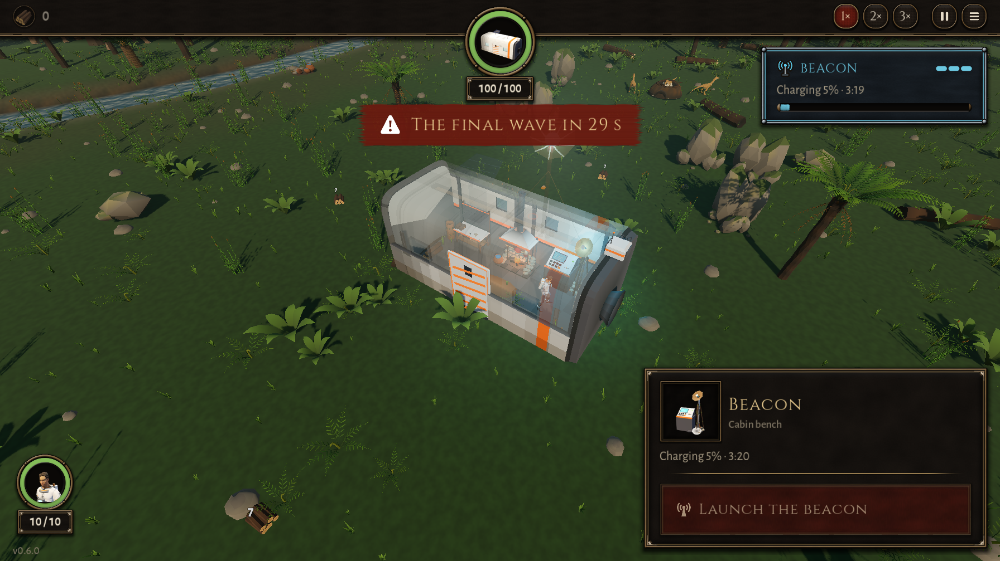

# BUG-002 信标启动以后，信标台卡片上的"启动信标"按钮还在

- 状态: open
- 严重度: 低（再按一次没有效果，但会让人以为没启动成功）
- 发现: 2026-09-28 · 提交 71646a4 + 未提交改动
- 复现: `bash debug-agent/tools/run_check.sh probe:launch_button`

## 步骤

1. 人走进船舱，修好信标三段。
2. 点信标台，卡片上出现红色的"启动信标"按钮。
3. 点这个按钮。

## 期望

启动后没有东西可启动了，按钮应该消失（或者变成不可点）。

## 实际

- 启动成功：顶上横幅"最后一波：29 秒后到"，右上角"充能 5%"。
- 但卡片上的"启动信标"按钮 **11 秒后还在**。卡片上的文字（"充能 5% · 3:20"）会更新，只是按钮没有刷新。
- 再按一次：没有任何效果（信标步数还是 4，没有开新活）。
- 点一下人、再点回信标台，按钮就没了，所以是**卡片没有在启动时重建按钮**。

重新选中以后正常：[img/BUG-002-reselected.png](img/BUG-002-reselected.png)

## 附带

同一张截图里，右上角信标面板写"3:19"，卡片写"3:20"，差 1 秒。可能是两处取整方式不同，很小，顺手看一下。
