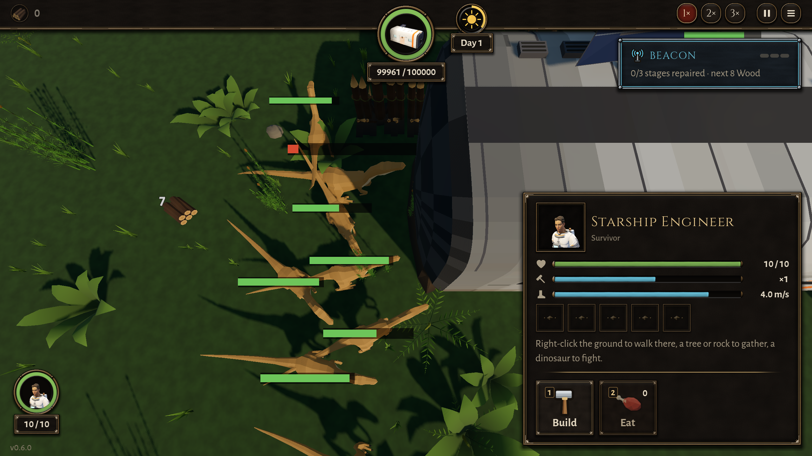
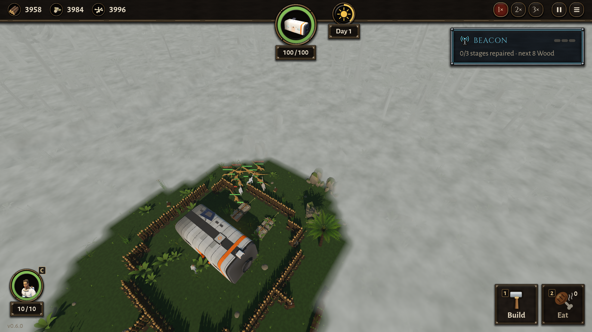

# BUG-005 背后半圈栅栏时，来袭挤在船舱开口的一头原地打转（"抽搐"还在）

- 状态: open
- 严重度: 中（就是玩家报的那个现象，TASK-002 修了一部分）
- 发现: 2026-09-28 · 在 ea36313 的干净快照上测（`tools/snapshot.sh`），3 次里 3 次都能复现
- 复现: `GODOT_PROJECT=$(bash debug-agent/tools/snapshot.sh ea36313) bash debug-agent/tools/run_check.sh probe:half_fence`

## 摆法

栅栏贴着船舱背面（北，巢那一侧）和东头，一共 13 段；西头和门那一侧空着（和 `siege:...:back` 一样）。来一波大波：头领 + 10 只腔骨龙。船舱在 (2, 2)，7×3，所以西墙在 x ≈ −1.5。

## 现象

来袭确实绕过来了（15 秒时有 3 只在咬船舱，比修之前好），但**西头只有一两个咬的位置**。其余的在西头排成一列，有几只原地打转，一直不咬：

```
一只腔骨龙，"engage 船舱"，12 s → 34 s（22 秒）都在 (−3.1, 3.4) 周围半米里：
12.25s 转 +48°   14.75s 转 −81°   19.00s 转 +78°   19.25s 转 −72°
22.25s 转 −129°  24.00s 转 −135°  24.50s 转 +127°  28.75s 转 +72° ...
（速度 0～1 m/s，一直在"走"，位置不变）

另一局，一只在 (−2.53, 2.38) 一动不动 4 秒，速度却是 4.0 m/s（全速顶着什么），左右各摆 48°：
11.50s −48°  12.00s +32°  12.50s −63°  12.75s +47°  13.50s −48° ...
```

每 0.25 秒采一次；"原地"是这 0.25 秒里挪动不到 0.15 米，"摆"是转过 20° 以上并且和上一次方向相反。一局 60 秒里，最严重的一只原地来回摆了 **17 次**。完全不围（bare）时是 3 次。



总览（15 秒）：[img/BUG-005-overview-t15.png](img/BUG-005-overview-t15.png)

## 期望

TASK-002："来袭绕过去咬船舱，没有一群恐龙在栅栏后面打转、抽搐"。咬的位置满了的，应该排队站着等（设计第 3 章："是同伴就排队等"），或者绕到别的面，而不是原地打转、全速顶着。

## 注意

- dev 给的 `siege:0:12:1:back` 判据这次是通过的（15 秒 3 只在咬；48 秒结束）。那个判据看的是"站着不动、也不咬"，但这里的恐龙一直在"走"（速度不是 0），所以它看不出来。
- `siege` 输出里的 "standing still, not biting" 把巢边的 3 只守卫也算进去了（守卫本来就站岗），只看这个数会误判。

## 复测（2026-09-28，7817a1e，含 7daf97e "a raptor stops on its spot and stays"）：还没好

`probe:half_fence` 两次 + `probe:half_fence_bare` 一次，和 7c86862 的基准比：

| 场景 | 7c86862 抽搐报告 | 7817a1e 抽搐报告 | 7817a1e 我的计数器：原地来回摆最多 | 最长站着不咬 |
|---|---|---|---|---|
| 半圈栅栏 第 1 次 | 6 | **11**（shake 9、jitter 2） | 10 次（一只在咬的，门那边 (1, 4)） | 13.5 s |
| 半圈栅栏 第 2 次 | 7 | 5（mill 2、shake 2、flicker 1） | **22 次**（西南角 (−2.9, 4.0)） | 26.3 s |
| 一点不围（BUG-007） | 4～6 | **1** | 4 次 | 13.3 s |

- 一点不围的那种好多了（BUG-007 那边的现象基本没了）。
- 半圈栅栏的没好：背面栅栏外 (−0.6～1.4, −0.9～−2.0) 还是挤成一团，有一只 2 秒里摆了 19 次、净位移 0.04 米（报告 #2）；西头 (−3.6～−2.2, −0.4～3.5) 也还有。
- 第 2 次那只西南角的，抽搐监测**没有报**，见 [BUG-008](BUG-008-twitch-watch-misses-a-slow-swing.md)。

## 复测（2026-09-28，f65f8ea，TASK-011）：好了一部分，还没过

`probe:half_fence`，人站在门外 3 次 + 人在船舱里 2 次（`DA_HERO_IN=1`，更公平：人站在门口时，门那边挤的恐龙可能是冲着人去的）：

| 次 | 人在哪 | 15 s 在咬船舱 | 抽搐报告 | 我的计数器：原地来回摆最多 | 最长站着不咬 |
|---|---|---|---|---|---|
| 1 | 门外 | 3 | 0 | **20**（西南角 (−3, 3)） | 21.0 s |
| 2 | 门外 | 3 | 1 shake | **15**（西南角） | 17.3 s |
| 3 | 门外 | 3 | 1 shake | **16**（西南角） | 19.3 s |
| 4 | 舱里 | **6** | **5**（shake 4、**push 1**） | **10**（门那边 (−1, 4)，在咬） | 25.3 s |
| 5 | 舱里 | **6** | **4**（shake 3、**push 1**） | **15**（门那边 (−1, 5)） | 26.5 s |

对照 TASK-011 的判据：
- 抽搐报告每局不超过 3 份、没有 push：人在门外的 3 次过了；人在舱里的 2 次**没过**（4、5 份，都有一份 **push**，两次都在同一个地方：东边栅栏南头、船舱东南角 (5.3, 4.8)，顶着栅栏 4 秒、净位移 0.0）。
- 我的计数器最严重的一只不超过 3 次：**5 次都没过**（10～20 次）。人在门外时是西南角那一只：站在 (−2.98, 3.63) 一动不动 18 秒，每秒左右摆 25°～52°，抽搐监测没报（就是 BUG-008）。设计里写的是"等的站着不动、脸朝船舱"，它站着不动，但脸一直在左右摆。
- 15 秒时在咬的只数：人在门外还是 3 只；人在舱里 6 只（好了）。

西南角那只的连拍（19.0～20.0 秒，每 0.25 秒一张）：[img/BUG-005-sw-corner-f65f8ea.png](img/BUG-005-sw-corner-f65f8ea.png)

## 补充：只咬开一段栅栏的口子，挤得更厉害（debug-agent, 2026-09-29, d9b75e9）

同一个根（一群挤在一个窄口子前），更窄的情形，抽搐最多的场景：

- 复现：`DA_SIEGE_SHOT=1 GODOT_PROJECT=$(bash debug-agent/tools/snapshot.sh d9b75e9) bash debug-agent/tools/run_check.sh siege:4:12:3:inside`（绊弩摆在围栏里面，3 章"想打的东西被墙整个围住"）。
- 行为本身对：10 秒左右咬穿北角的一段栅栏，从那一格排着进去。
- 但口子外面挤成一团，一局 **62 份抽搐报告**（shake 34、mill 20、fidget 6），x −3.5～1.7、z −6.2～−2.3，全挤在口子前后，念头是 ENGAGE → set_crossbow，多数"pressed … wall"。
- 4e24eb4（刚加"咬墙进去"那次提交）同一个场景的画面一样（那时还没有抽搐监视，数不出来），所以不是新退化，只是 BUG-005 的另一个样子。结果（船舱剩多少、绊弩剩几架）每局差很多，是随机，不是退化。



修 BUG-005 时这个场景可以当测试：一格宽的口子，12 只排队进去不该抖。
