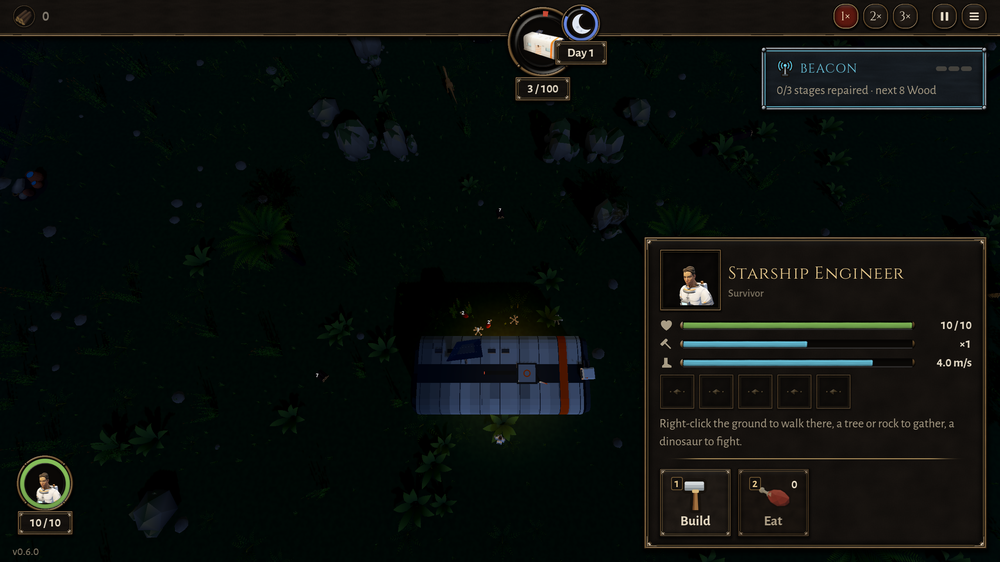

# BUG-006 天快黑时出发的来袭，黄昏以后才走出巢的那些不回巢，照样咬船舱

- 状态: open
- 严重度: 高（船舱差点被咬穿：100 → 2.8；而且整局里真的会碰到）
- 发现: 2026-09-28 · 在 ea36313 的干净快照上测（TASK-006）
- 复现: `GODOT_PROJECT=$(bash debug-agent/tools/snapshot.sh ea36313) bash debug-agent/tools/run_check.sh probe:dusk_raid`

## 现象

一波来袭是一只一只从巢里走出来的（每 0.8 秒一只）。黄昏开始那一刻，游戏只让**已经在外面**的恐龙回巢（`WaveManager._on_day_part_changed` 只在天色变化时调一次 `go_home`）。
这一波**剩下还没走出来的，黄昏以后照样走出来**，而且没有人叫它们回去：它们去咬船舱，一直咬到入夜。

探针：黄昏前 2 秒放出一波大波（头领 + 10 只）：

```
11 只里，9 只是黄昏开始以后才走出巢的
只有 4 只回了巢；其余的去咬船舱
船舱 100 → 2.8（黄昏那 30 秒里）
黄昏 1 秒以后还在咬船舱的：@CharacterBody3D@142（245.0 起）、@CharacterBody3D@145 ……
这一波到时钟 274.3（已经是夜里）才结束；设计要求黄昏开始 30 秒内结束
```

整局里真的会遇到：机器人 `play:30` 那一局，第 3 波（大波）在时钟 237 出发，离黄昏只有 3 秒。黄昏开始 10 秒后还丢了一架窝弩。



## 期望

GAME-DESIGN 9.3 / TASK-006："天一到黄昏，正在外面的来袭掉头回巢，到巢就消失，不掉东西，这一波算结束"。黄昏以后不应该再有腔骨龙走出巢来攻击。

## 可能的修法（供参考，没改代码）

- 黄昏时把这一波还没出来的直接取消（`dinos_to_spawn` 减掉，停掉 `spawn_timer`）；或者
- 出生的时候看一下现在是不是它的作息，不是就直接 `go_home`，或者干脆不生。
- 这一波的只数统计也要跟着对（`dinos_alive_count`），否则这一波会一直不结束。
