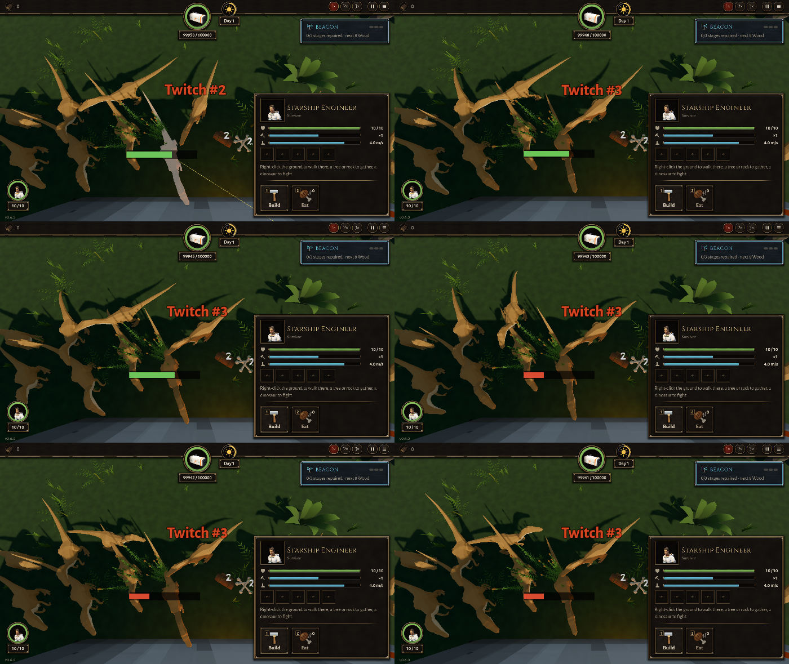

# BUG-007 船舱一点不围，普通大波也会挤在船舱背面抖（抽搐监测报 shake / jitter）

- 状态: open
- 严重度: 中（和 BUG-005 同一类现象，但不需要栅栏）
- 发现: 2026-09-28 · 在 7c86862 的干净快照上测（TASK-010）
- 复现: `GODOT_PROJECT=$(bash debug-agent/tools/snapshot.sh 7c86862) bash debug-agent/tools/run_check.sh probe:twitch_cam`
  （或 `probe:half_fence_bare`；报告汇总在那一次运行目录的 `twitch.txt`）

## 现象

船舱周围**什么都没造**，来一波大波（头领 + 10 只）。TASK-010 期望"普通来袭没有报告"，实际两次都报了：

```
probe:half_fence_bare（7c86862）：6 份，全是 shake
  #1 shake ENGAGE->core at ( 1.0,-1.2)  2 s: shake 6  path 1.08 net 0.94  挤着它的 0 只
  #2 shake ENGAGE->core at ( 2.5,-1.2)  2 s: shake 3  path 0.85 net 0.59  1 只
  #3 shake MARCH  ->-    at ( 1.5,-2.1)  2 s: shake 4  path 1.03 net 0.84  2 只
  #4 shake MARCH  ->-    at ( 1.3,-1.8)  2 s: shake 3  path 0.95 net 0.94  2 只
  #5 shake ENGAGE->core at ( 0.7,-1.2)  2 s: shake 3  path 0.34 net 0.25  3 只
  #6 shake ATTACK ->core at ( 2.2,-0.2)  2 s: shake 3  path 1.19 net 0.90  0 只
probe:twitch_cam（7c86862）：4 份
  #1 shake  ENGAGE->core at (1.4,-1.4)  shake 6
  #2 shake  ENGAGE->core at (1.4,-1.2)  shake 3
  #3 jitter ENGAGE->core at (1.4,-1.1)  jitter 4 shake 6 flicker 3  path 0.41 net 0.18
  #4 shake  ENGAGE->core at (2.6,-1.1)  shake 3
```

船舱在 (2, 2)，背墙（北，巢那一侧）在 z ≈ 0.5。所有报告都在**背墙外面 1～2 米**：一群腔骨龙挤成一团，都想咬船舱，咬的位置不够。

## 我看了截图，判断是真的

`probe:twitch_cam` 在报告一出来时对那只恐龙从上面连拍 4 张，间隔 0.3 秒。#2、#3 那只（头上红字 "Twitch #3"）在一团 5、6 只的中间，每张的朝向都不一样，左右来回摆。和我自己的计数器对得上：`half_fence_bare` 那次，同一个位置一只恐龙原地来回摆了 ±74°、+80°、−91°、+30°。



## 和 BUG-005 的关系

BUG-005 是背后半圈栅栏以后，恐龙挤在船舱开口那一头。这里**没有栅栏**，恐龙照样挤在离巢最近的那一面（背墙），咬的位置满了，外面一圈的就原地来回转。看起来是同一个原因：咬船舱的位置被占满以后，后来的在原地来回挑位置。修 BUG-005 的时候请一起看这个场景。

## 顺带看到的

截图里一团恐龙的身体互相插在一起（设计第 3 章："谁也不会和谁重叠"）。从正上方看，尾巴和脖子叠在一起可能只是视角问题，我没法确定，先记在这里，不单独报。

## 补：一整局里也有（`play:20`，7c86862）

机器人那一局，第 3 波（大波）的腔骨龙挤在栅栏圈北边的窝弩那里，7 份报告（shake 5、flicker 1、jitter 1、mill 1），念头都是 ENGAGE / ATTACK → 窝弩，位置都在 (−2.7～−0.2, −1.8～−3.4)。看起来是同一回事：一群恐龙抢同一个目标，咬的位置不够，后面的在原地转。
