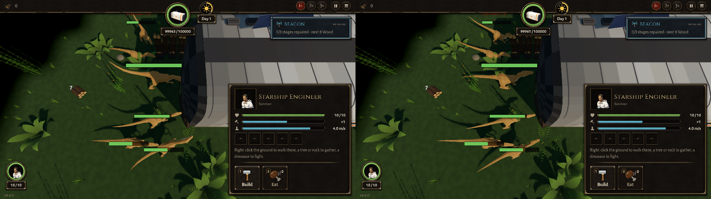

# BUG-008 抽搐监测漏报：原地一动不动、每秒来回摆一次头，摆了 22 秒，没有报告

- 状态: open
- 严重度: 中（监测本身的漏报：最显眼的那种"傻站着甩头"它看不见）
- 发现: 2026-09-28 · 7817a1e（TASK-010 的"找漏报"）
- 复现: `GODOT_PROJECT=$(bash debug-agent/tools/snapshot.sh 7817a1e) bash debug-agent/tools/run_check.sh probe:half_fence`（两次里有一次最清楚；看日志里的 `twitch:` 行和 `twitch.txt`）

## 现象

半圈栅栏（背面 + 东头）+ 大波。一只腔骨龙在船舱西南角（门那边）(−2.87, 3.98)，念头一直是 ENGAGE → 船舱：

```
11.75s 转 −72°   12.00s 转 +96°
12.75s −22°  14.00s +22°  14.75s −22°  15.75s +22°  16.50s −22°  17.75s +22°
18.50s −22°  19.50s +22°  20.50s −22°  21.50s +22°  26.25s −22°  27.50s +22°
28.25s −22°  29.50s +22°  30.25s −22°  31.50s +22°  32.25s −22°  33.50s +22°  34.25s −22°
位置从 12 s 到 34 s 一直是 (−2.87, 3.98)，速度 0.00
```

也就是说它**站着一动不动 22 秒，一口没咬，每 0.75～1.25 秒左右摆一次 22°**。玩家看到的就是"傻站着甩头"。这一局的 `twitch.txt` 里 5 份报告，没有一份在这个位置。

同一个角在 7c86862 的基准里也出现过（站着不动 31.3 秒），那次也没报。

## 为什么漏（看 Config.TWITCH，没改代码）

`settle: 0.3`："转一下、停一会儿、几秒后再转回来，不算 shake"。这里每次摆完都停了 0.5～1 秒，所以每一摆都被当成新的一段，`shake_flips: 3` 永远数不到。而它又没在要求走路（push 不管），也没走路（mill、jitter 不管）。

## 建议

- shake 在"位置几乎不动"时放宽 settle：比如 `net` < 0.1 米时，隔 1.5 秒以内的反向摆动也连起来数；或者
- 加一种 **stall**（TASK-010 结果里提过）：ENGAGE/BREACH 念头下、不在咬、位置 N 秒不动，就报。这一只能同时被这两条抓到。

截图（18.5 s、19.0 s，西头近景；最下面那只在西南角）：


