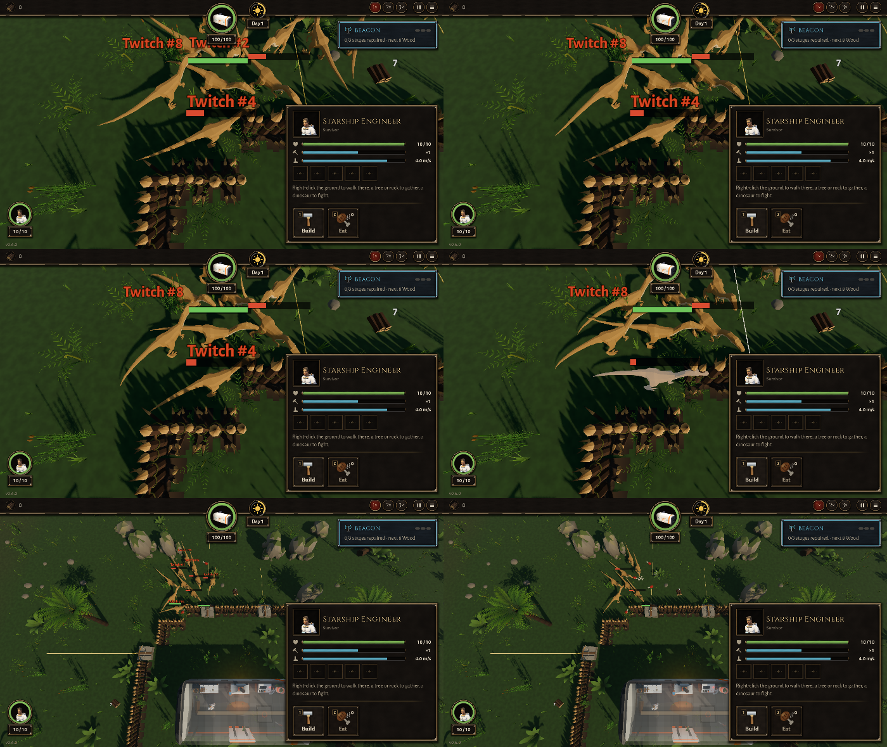

# BUG-009 整圈栅栏 + 窝弩：来袭全冲着同一架窝弩，堆在栅栏角外面转圈、抖、顶

- 状态: open
- 严重度: 中（最常见的基地摆法；每局 13～17 份抽搐报告）
- 发现: 2026-09-28 · f65f8ea（TASK-011 的第二部分）
- 复现: `GODOT_PROJECT=$(bash debug-agent/tools/snapshot.sh f65f8ea) bash debug-agent/tools/run_check.sh siege:4:12:1`，或 `probe:ring_traps`（同样的摆法，还会拍报告出来时的连拍和两张俯视图）

## 摆法

船舱外 6.5 米一整圈木栅栏（封死），北边（巢那一侧）嵌 4 架窝弩，朝外。一波 12 只腔骨龙从巢出来。

## 现象

来袭里 10～11 只**同时去打同一处的窝弩**（`going for { set_crossbow: 10～11 }`），但栅栏外能咬到它的位置只有一两个。其余的堆在圈的西北角外面，转圈、抖、顶在栅栏角上，同时挨窝弩射。这一波最后是守住的（12 只都死了、船舱 100/100），但过程就是玩家说的"转来转去、抽搐"。

| 运行 | 报告 | shake | mill | jitter | push |
|---|---|---|---|---|---|
| `siege:4:12:1` 第 1 次 | 13 | | | | |
| `siege:4:12:1` 第 2 次 | 13 | | | | |
| 两次合计 | 26 | 17 | 4 | 3 | 2 |
| `probe:ring_traps` | 17 | 10 | 4 | 1 | 2 |

位置全在 (−3.3～0.5, −3.9～−8.0)，也就是圈的北边、偏西的那一段外面；念头全是 ENGAGE → set_crossbow（只有开头 2 份是刚出巢的 MARCH 和一份 BREACH）。有代表性的几份（`probe:ring_traps`）：

```
#4  push   (-1.9,-4.1) ENGAGE->set_crossbow  4 s: path 1.36 net 0.04  顶着栅栏角  jitter 4 shake 7
#7  mill   (-2.3,-7.6) ENGAGE->set_crossbow  6 s: path 6.93 net 1.46  shake 23
#10 mill   (-2.1,-7.0) ENGAGE->set_crossbow  6 s: path 9.21 net 1.36  shake 14
#14 jitter ( 0.3,-6.0) ENGAGE->set_crossbow  2 s: path 0.79 net 0.27  jitter 4 shake 11
#16 shake  ( 0.3,-6.1) ENGAGE->set_crossbow  2 s: path 0.15 net 0.06  shake 6
```

同一个 push 的位置 (−1.9, −3.9～−4.1) 在 3 次运行里都出现了：一只顶在栅栏角上。

截图（上面四张：报告 #4 那只的连拍，它顶在栅栏角上，被射中时身体发白；下面两张：12 秒和 20 秒的俯视，一群堆在圈的西北角外面）：



## 我的判断

- **push、mill、jitter 是真的。** 连拍里 #4 那只一直顶在栅栏角上不动；mill 的那几只 6 秒走了 7～9 米，还在原来那一米多的范围里打转。
- **shake 里大部分是挤在一团时的来回扭**，和 BUG-007 是同一类。
- 原因看起来和 BUG-005/007 一样：大家都选同一个目标，咬的位置不够，后面的不排队而是在原地挑位置。设计第 3 章："是同伴就排队等"；f65f8ea 给船舱加了排队，**但窝弩（还有别的建筑）好像没有**，所以对着船舱好了很多，对着窝弩还是这样。
- 另外值得想一想：10 只都去打同一架窝弩，是不是应该分散到别的窝弩、或者去咬栅栏（设计："机关本身也是一格建筑，挡路；恐龙会离开路线去咬射它的机关"。是"射它的"那一架，不是所有的都去同一架）。
