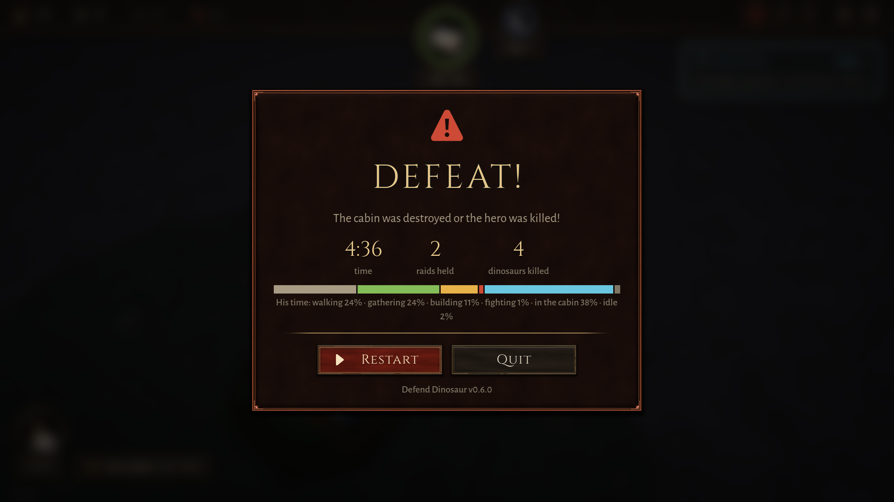

# BUG-011 失败画面不说是怎么输的（船舱满血，写的却是"船舱被毁或人阵亡"）

- 状态: open
- 严重度: 低（界面）
- 发现: 2026-09-28 · 7426dbc，机器人整局（`play:25`，runs/20260928-194845）

## 现象

人在巢边采石时被守卫咬死（DOC-004），游戏结束。失败画面写的是：

> The cabin was destroyed or the hero was killed!（中文："废弃船舱被毁或角色阵亡！"）

当时船舱是 **100/100**，玩家看到"船舱被毁或……"会以为船舱出了事，不知道其实是人死了。游戏自己是知道的：人死时发了 `hero_died`，机器人日志里也是先 "THE HERO DIED" 再 "GAME LOST"。

## 期望

分开说：船舱被攻破就写船舱被攻破，人倒下就写人倒下（最好带上在哪、被什么咬的，比如"工程师在巢边被守卫咬死了"）。第 3 章："人死了游戏结束"和"船舱被攻破就输"是两条不同的规则，玩家要知道自己输在哪一条上。

## 位置（没改代码）

`scripts/ui/HUD.gd:753` 两种情况都用同一个 `GAME_DEFEAT_DESC`；`translations/strings.csv:151`。
