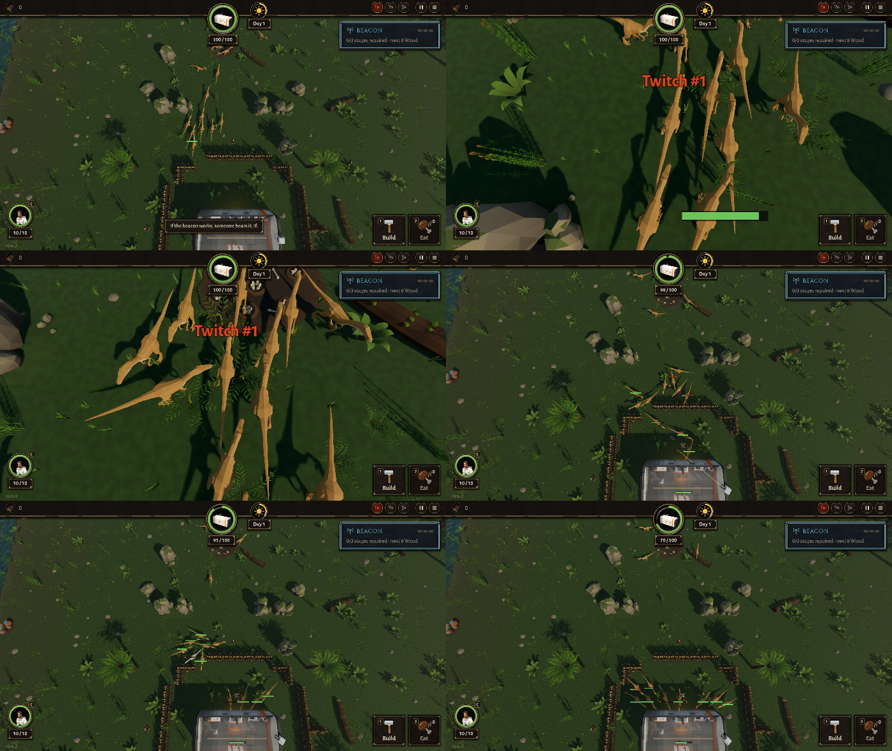

# BUG-012 整圈栅栏被咬开一个口子以后，整群来袭先跑回巢边转圈，过十来秒才回来进口子

- 状态: open
- 严重度: 中（整圈封死是最常见的防守；每一波都会这样，而且是这一波里抽搐报告最多的来源）
- 发现: 2026-09-28 · 357b603（TASK-017 里测 `siege:0:12:1` 时看到），8646202 上也有，357b603 更严重
- 复现: `GODOT_PROJECT=$(bash debug-agent/tools/snapshot.sh 357b603) bash debug-agent/tools/run_check.sh siege:0:12:1`，或 `DA_NO_TRAPS=1 … probe:ring_traps`（带俯视图和连拍）

## 现象

船舱外 6.5 米一整圈木栅栏（42 段，封死），没有机关，一波 12 只腔骨龙：

```
 5 s  breach 5、attack 1 → 都在咬栅栏（going for wall 6）        栅栏 42/42
 9 s  march 11 / 15  → 所有来袭都变回"行军"，没有目标（going for nothing）  栅栏 41/42（咬开了一段）
      离船舱的平均距离从 12 m 变成 14.7～16.3 m：它们在往回走
10～15 s  巢边一群 mill：6 秒跑了 15～21 米，净位移不到 1 米
12～20 s  回来了，从口子进去咬船舱
```

抽搐报告：357b603 两次 8、16 份，其中 mill 7、10 份，大多是 **MARCH、没有目标、在巢边** (−1.5～1.9, −16.4～−8.3)。8646202 同一个场景 8 份（mill 4），15 秒时已经有 3 只在咬船舱（357b603 两次都是 0 只），所以 357b603 让它更久了。

截图（左上 9 秒俯视：一列往北走回巢；右上和左中：巢边挤成一团转圈，能看到巢里的蛋；右中、下两张 12 / 15 / 20 秒：回来从口子进去）：



## 猜的原因（没改代码）

咬开一段以后圈不再封死，来袭重新找路时像是从**路线的第一个路点**（巢）重新开始走，于是先回到巢边，在那里转，再重新出发。

## 期望

咬开口子以后，就近从口子进去（设计第 3 章："咬穿了再进去"），不往回走。
