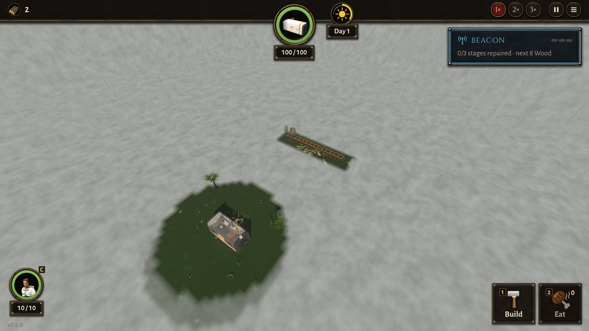

# BUG-013 大山谷：山梁中间的口子被栅栏封住，来袭绕西边过来以后，挤在栅栏后面"原来的路点"上转圈

- 状态: open
- 严重度: 中（大山谷里"封一个口子"本来就是设计要玩家做的选择：9.2"有了绕路，要不要把口子封死才是一个有代价的选择"）
- 发现: 2026-09-29 · 30c4d1a（TASK-018）
- 复现: `DA_MAP=valley_large DA_BLOCK_MIDDLE=1 GODOT_PROJECT=$(bash debug-agent/tools/snapshot.sh 30c4d1a) bash debug-agent/tools/run_check.sh probe:routes`

## 现象

大山谷，山梁中间那个宽口子用 28 段木栅栏封住（世界坐标 x −6～11、z −25～−24），一波 9 只腔骨龙从巢出发：

- **绕路是对的**：9 只都往西走到 x = −8.4，从西边绕过栅栏的一头（没有一只穿墙，28 段一段没少）。
- **但绕过来以后**，其中 5 只没有去船舱，而是走回栅栏南面、中间口子那里 (0～2, −21～−22)，**念头是 MARCH、没有目标**，顶着栅栏转了 16 秒以上。这一局 10 份抽搐报告全在那里（mill 5、shake 3、jitter 1、flicker 1）：

```
#3 mill   (-0.5,-20.8) MARCH -> -  6 s: path 11.43 net 0.41
#4 mill   ( 1.0,-21.1) MARCH -> -  6 s: path  7.66 net 0.99
#8 mill   ( 1.0,-21.9) MARCH -> -  6 s: path  7.96 net 1.35  顶着栅栏
#10 jitter( 1.1,-21.9) MARCH -> -  2 s: jitter 16 shake 15 net 0.13  顶着栅栏
```

- 60 秒里只有 4～5 只到了船舱（中间口子没封时 9 只全到，第一只 10 秒）。



## 猜的原因（没改代码）

大山谷的来袭路线（30c4d1a："来袭路线改成按地图数据摆"）大概有一个路点就在中间口子上。口子封了以后，它们绕过栅栏，还是要先"到那个路点"，而路点就在栅栏脚下，于是在那里挤、转。这和 [BUG-012](BUG-012-raid-goes-back-to-the-nest-after-a-breach.md)（咬开口子后回到第一个路点、也就是巢边转圈）看起来是同一个根：**跟着路点走，而不是跟着目标（船舱）走**。

## 期望

口子被封，绕路过来以后直接去船舱；到不了的路点应该跳过。
