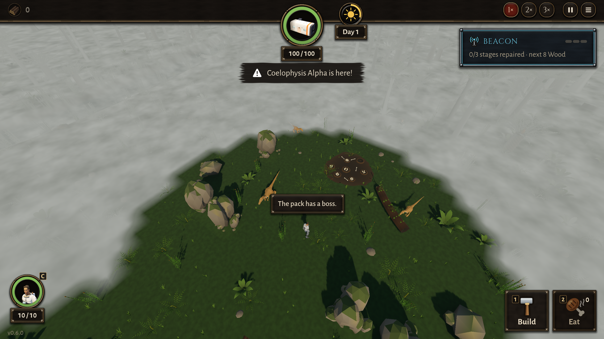

# BUG-014 小山谷：英雄站在巢边看着，来袭照样在他眼前"冒"出来（边缘出生点离巢太近）

- 状态: open
- 严重度: 中（违反 v0.6 第四轮玩家说的"raid 的时候直接冒出新的恐龙似乎有点奇怪"，而 d9b75e9 就是为这个修的）
- 发现: 2026-09-29 · d9b75e9（TASK-019 第 3 条）
- 复现: `GODOT_PROJECT=$(bash debug-agent/tools/snapshot.sh d9b75e9) bash debug-agent/tools/run_check.sh probe:edge_nest_watched`（小山谷；大山谷加 `DA_MAP=valley_large` 是好的）

## 现象

小山谷，英雄站在巢往船舱方向 6 m 的地方 (1.3, −11.0)，巢 (1, −17) 在他眼里。来一波 14 只：

- 巢被看着，所以一只都没从巢出来（对）。它们改从巢背后的边缘出来：edge0 (−5, −19)、edge1 (7, −19)。
- **可这两个边缘点也都在他眼里**（离他约 10 m）。`_next_origin` 找不到没人看的点，就走最后的"anyway"，照样在那里放。
- 结果：**15 只里 10～15 只是在他看得见的地方出生的**，跑了 3 次都这样：

```
stepped out in his sight: 15 ["edge0 at (-4.37, -18.35), 9.3 m from him", "edge1 at (6.54, -18.72), 9.3 m from him", ...]
stepped out in his sight: 10 ["edge1 at (6.66, -19.10), 9.7 m from him", "edge0 at (-5.0, -19.0), 10.2 m from him", ...]
```



对照：

| 情形 | 结果 |
|---|---|
| 大山谷，同样站在巢前 | 巢背后的边缘在 z −41，离巢 6 m，他看不到，0 只在眼前出生 ✔ |
| 小山谷，站在第一个边缘点上 | 全部从 edge1 来，0 只在眼前出生 ✔ |
| 小山谷，站在巢前 | 巢和两个边缘点都在眼里 → 全在眼前出生 ✘ |

## 猜的原因（没改代码）

小山谷的 `reinforce_positions` 在 z −19，巢在 z −17，只差 2 m，场地边就在巢背后。英雄只要走到巢边看巢，就同时看到了所有"边缘"，`WaveManager._next_origin` 的兜底就在他眼前放人。

## 期望

两种改法任选，或者让设计定：
1. 小山谷的边缘点挪到迷雾里、离巢更远（像大山谷那样隔 6 m 以上），站在巢边也看不到；
2. 所有点都被看着时，先别放（等一等，或者放到场外更远的地方再走进来），而不是"anyway"在他眼前放。
