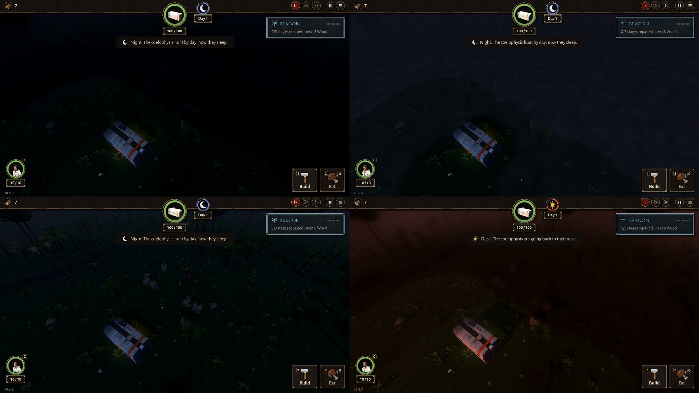

# BUG-016 夜里没去过的浓雾是一片纯黑（又回到了"黑色的战争迷雾"）

- 状态: open
- 严重度: 中（玩家明确说过迷雾不要黑：TASK-012 黑雾 → TASK-014 改成山谷里的雾；这次改完夜里又黑了）
- 发现: 2026-09-29 · 04b79b1（TASK-020）
- 复现: `GODOT_PROJECT=$(bash debug-agent/tools/snapshot.sh 04b79b1) bash debug-agent/tools/run_check.sh probe:mist_hours`

## 现象

夜里（day_clock 312），开局镜头，画面上半截没去过的浓雾是纯黑，看不出是雾，和旧的黑色战争迷雾一样。

探针把画面上场地里的每个采样点按迷雾分成三层（看得见 / 去过的薄雾 / 没去过的浓雾），比同一批像素"有雾"和"把雾揭开"时的亮度，算出雾实际乘了多少：

| 时辰 | 设定的系数 | 薄雾实际 | 浓雾实际 | 浓雾亮度 |
|---|---|---|---|---|
| 正午 | 1.3 | ×1.08 | ×1.16 | 0.270 |
| 黄昏 | 0.6 | ×0.76 | **×0.40** | 0.025 |
| 夜里 | 0.5 | ×0.54 | **×0.05** | **0.001**（纯黑） |

（亮度是 0～1 的屏幕亮度。改之前夜里浓雾是 0.066，看得见的地方 0.105。）

薄雾基本按设定走，**浓雾在黄昏和夜里比设定暗得多**，夜里几乎是 0。

## 猜的原因（没改代码）

浓雾那一层可能除了"时辰系数"还叠了别的变暗（比如没去过的那一档自己的系数、或者取亮度的时候取到了已经被雾盖住的屏幕），两个乘起来夜里就到了零。

## 期望

浓雾夜里也按 0.5 倍左右它底下的地面亮度，看上去是"很暗的雾"，而不是黑幕；和薄雾差一档，但两层都还看得出是雾。
