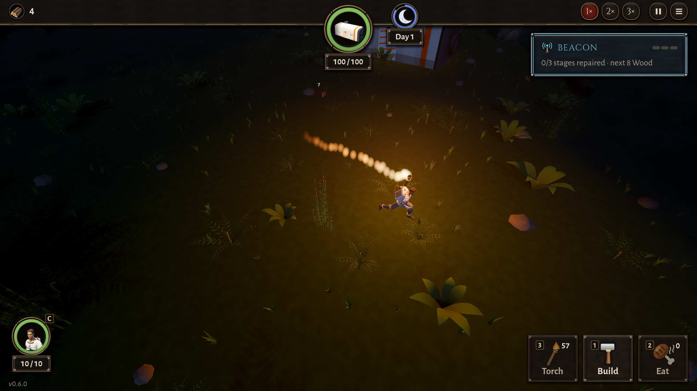
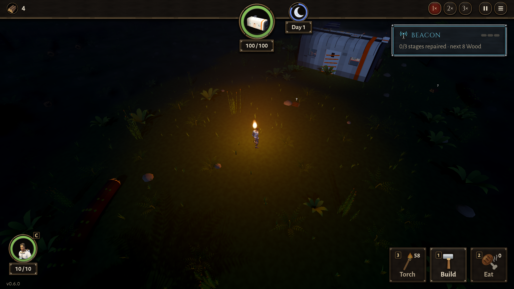

# BUG-017 举着火把走路时，火苗在身后拖出一串 3 米长的"火球"

- 状态: open
- 严重度: 低（看起来怪，不影响玩）
- 发现: 2026-09-29 · 7f8ee65（TASK-021）
- 复现: `GODOT_PROJECT=$(bash debug-agent/tools/snapshot.sh 7f8ee65) bash debug-agent/tools/run_check.sh probe:fire_night`，看 `torch_walking` 那张

## 现象

站着的时候火把的火苗是对的（一小团往上飘）。一走起来，火苗在他身后拖出一条直线，大约 15 个分开的亮点，长 3 米左右，像火箭尾焰或者彗星，不像火把。

站着（对照）：

## 猜的原因（没改代码）

火苗是 GPUParticles3D（Config.FIRE.flame：lifetime 0.8 s，32 个），粒子在世界坐标里放出来，人以 4 m/s 往前走，0.8 s 就是 3 米的尾巴；一帧放一两个，所以是一颗一颗分开的。

## 期望

走路时火苗最多往后歪一点。可以让火把的粒子用本地坐标（`local_coords = true`），或者火把的粒子寿命短一些、数量多一些。篝火、火盆不动，不受影响。
