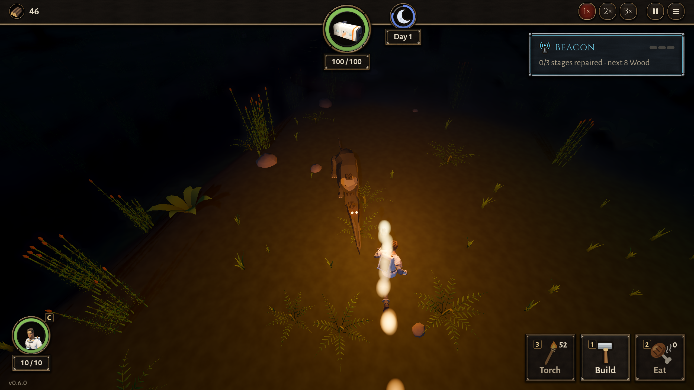

# BUG-018 举着火把追植龙，把它逼到场地边上以后，它就停在火光里、贴着人不动

- 状态: fixed（0974047 复测：逼到角落就扑上来咬，再跑开；见 TASK-022）
- 严重度: 低～中（和"植龙不进火光"的规则相反；玩家举火把去赶植龙时一定会遇到）
- 发现: 2026-09-29 · 7f8ee65（TASK-021 第 5 条）
- 复现: `DA_NIGHTS=1 DA_PROWL=torch GODOT_PROJECT=$(bash debug-agent/tools/snapshot.sh 7f8ee65) bash debug-agent/tools/run_check.sh probe:prowl`

## 现象

夜里，人举着火把（照 7 米）一直走向第一只植龙：

- 开头它会退：距离 14 → 4.9 m，然后在 4.9～4.3 m 保持了 6 秒（它退的速度 3.9 m/s，人走 4 m/s，所以慢慢被追上）。
- 退到场地西北角 (−21.6, −21.6) 退不动了：距离 3.7 → 2.7 → 1.7 → **0.9 m**，之后 7 秒一直 0.9 m，站着不动（速度 0，`is_wary` 还是 true）。
- 整晚它有 54 个采样点在"比它该站的更里面"（离火光中心不到 7 − 1.6 = 5.4 m），最深在火光里 6.15 m。
- 火把灭了以后它咬人（人被咬掉 6 血），被人打死。

```
torch: 15 s walking at it, the distance every 0.25 s: 14.0 9.6 8.2 7.2 6.2 5.3 4.9 4.9 ... 4.4 4.3 3.7 2.7 1.7 0.9 0.9 0.9 ...
torch: within 2 m of him with the torch lit: at (-21.57, 0.0, -21.59) (he at (-20.39, 0.0, -20.30)), mode 1, wary true, velocity 0.00
```



## 猜的原因（没改代码）

`ProwlerDino._act` 退的时候只往"离光心的反方向"退（`centre + away * edge`）。人从哪边来它就往对面退，退到场地边（河、谷壁）过不去，就停在原地，而这时候它还在火光里。

## 期望

退不动的时候沿着火光的边绕开（往左右走，绕到人身后或旁边的暗处），而不是停在火光里。实在绕不开，贴着人不动也不对：要么被逼急了咬一口再跑，要么明确"逼到角落就反扑"，设计定一个。
