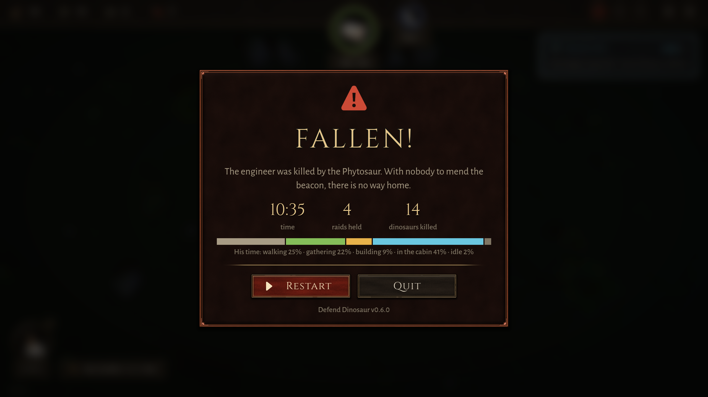

# BUG-019 夜里人在去干活的路上被植龙堵住、咬死，一下都没还手（原地走了 4 秒）

- 状态: fixed（0974047：去干活的路上被咬会还手；"走到那里"被堵死的情形另开 BUG-022）
- 严重度: 中（人死了一局就输；玩家夜里派人出去修栅栏、砍树时会遇到）
- 发现: 2026-09-29 · 7f8ee65（自由找 bug，`map:valley_large play:25`）
- 复现: `GODOT_PROJECT=$(bash debug-agent/tools/snapshot.sh 7f8ee65) bash debug-agent/tools/run_check.sh map:valley_large play:25`（这一局 10:35 结束）

## 现象

大山谷，第 2 个夜里，植龙在咬船舱外面那圈栅栏（这一夜掉了 4 段），机器人出去修栅栏、砍木头：

```
[play 628.4s] STUCK? he has been walking on the spot for 4s while working wood, at (-3.13, 0.001, 4.01)
[play 629.1s] LOST a wall
[play 630.2s] hero moving hp 4.0/10 at (-3, 4) | ... | 6 dinos
[play 631.7s] THE HERO DIED
```

- 他在船舱旁边 (−3, 4) 原地走了 4 秒（状态是 MOVING，去干活的路上），3 秒内从 10 血被咬到 0。
- 这一局他的时间里"打架 0%"：**一下都没还手**。
- 失败画面写"工程师被植龙咬死"（对）。



## 原因（读代码，没改）

`Hero._hit_back()`（Hero.gd 1433 行）被咬时只有在 `HARVESTING` 或 `BUILDING` 状态才转身打；注释说"a walk the player sent him on … are the player's to change"。可是"去砍树 / 去修栅栏的路上"也是 MOVING，所以被堵在路上挨咬时他不还手、继续往前挤。植龙三米半长，堵在栅栏口子上正好把他挡住，他就原地走、一直挨咬。

## 我复现到的部分

`probe:bitten_on_the_way`：夜里一只植龙放在他和一棵 11 m 外的树中间，叫他去砍树。这一次它没把他堵住（他从旁边走过去了），走到树下开始砍、被咬以后他会转身打（通过）。**但是一只植龙就把他从 10 咬到 2.8** 才被打死：两只同时在就会死。游戏里那一次是被堵在路上，这一步没复现出来。

## 期望

去干活的路上（玩家叫他去砍、去修，不是"走到那里"）被咬、而且走不动了，也应该转身打。或者至少：被咬着、原地走了一两秒，就当成在干活，转身。纯粹"走到那里"的命令可以照旧不管。
