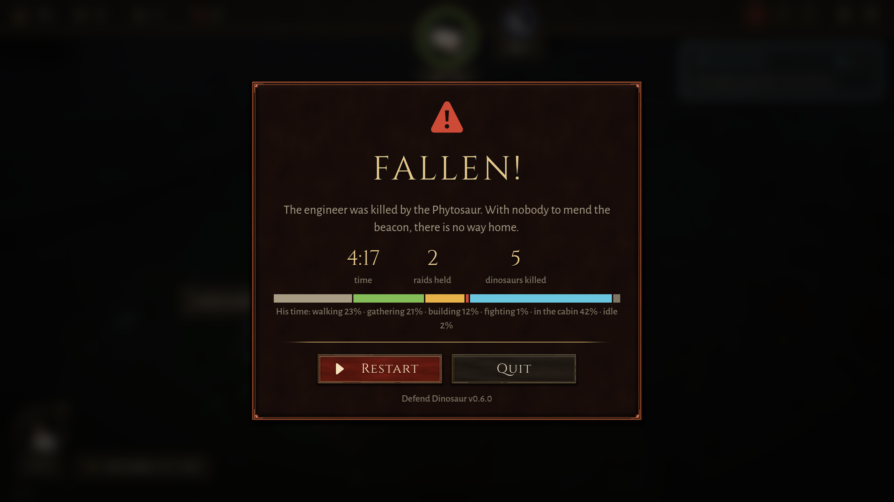
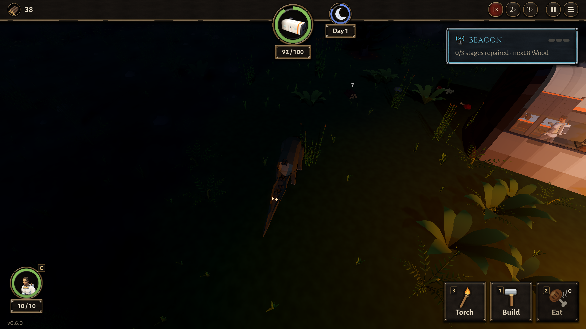

# BUG-022 小山谷夜里回船舱：在船舱西头被咬船舱的植龙堵住，原地走、不还手，被咬死

- 状态: fixed（0c903fb 复测：小山谷 play:25 在 267 秒修栅栏时被堵，这次还手打死了植龙，整局 11:47 打赢）
- 严重度: 中（机器人两局小山谷都这样死；玩家夜里从西边回家也会走这条路）
- 发现: 2026-09-29 · 7dd3f34（TASK-022 第 6 条）；7f8ee65 大山谷那一次（BUG-019）是同一个样子
- 复现: `GODOT_PROJECT=$(bash debug-agent/tools/snapshot.sh 7dd3f34) bash debug-agent/tools/run_check.sh play:25`（4:17 结束，第一夜）

## 现象

```
[play 230.7s] LOST a wall
[play 237.5s] a phytosaur died
[play 246.8s] LOST a wall
[play 252.8s] STUCK? he has been walking on the spot for 4s while walking to the workbench, at (-3.85, 0.001, 3.14)
[play 255.0s] THE HERO DIED
```

失败画面："工程师被植龙咬死"。这一局打架 1%。

两次死的位置几乎一样：7f8ee65 那局在 (−3.1, 4.0)（去砍木头），这一局在 (−3.8, 3.1)（去工作台）。都在船舱西南角外面。

## 为什么总在这里（读代码和配置，没改）

- 船舱的门在南墙中间（`CABIN.module.door.x = 0`），从西边回来要绕过船舱西头。
- 植龙从西边河里上来（`prowl_from` 都在 x −10 格），冲船舱来，就趴在船舱西头咬。
- 它三米半长，正好横在"西边 → 门"那条路上。人走过去被它挡住，原地走；这是"走到那里"（去工作台），按 0974047 的规则不还手；于是一直挨咬，3 秒内从 10 到 0。
- 0974047 修的是"去干活的路上被咬要还手"（`probe:bitten_on_the_way` 通过）；这里是"走到某处"，规则上故意不管。



## 期望（要设计定一种）

1. 走着的时候被咬、而且**走不动了**（原地走了一两秒），不管是什么命令，都转身打；或者
2. 被咬时就停下来、弹一句"他被咬了"（现在有"他被攻击了"的提示），让玩家点那只植龙；机器人要学会这一步；或者
3. 植龙不在门前这条路上咬（比如只咬船舱北墙），让人回得了家。

大山谷上同样的一局（7dd3f34）赢了，14:32 跳走，两夜都没事。

## 复测（2026-09-29, 0c903fb）

小山谷 `play:25`：267.6 秒"修栅栏时原地走了 4 秒"，同一秒"一只植龙死了"——他还手了。整局 11:47 跳走，打死植龙 7 只，船舱 39，人 7.5。眼睛近看现在是两个小亮点：


