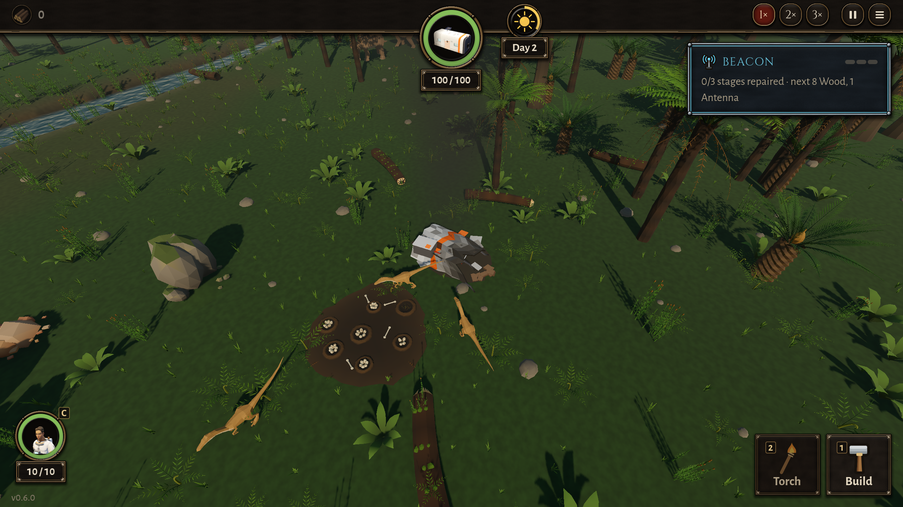

# BUG-023 电池那块残骸白天夜里都在守卫圈里，只能打死三只守卫才拿得到；可夜里的提示说"腔骨龙睡了"

- 状态: open（b631095 复测：改善了——守卫夜里睡；但翻的响声一只只叫醒，醒的直接扑、不示威）
- 严重度: 低～中（拿得到，但只能打死三只守卫；和夜里的提示对不上）
- 发现: 2026-09-29 · ee5c5dc（TASK-025 第 5 条）
- 复现: `DA_PART=battery DA_STEPS=1 DA_CLOCK=300 GODOT_PROJECT=$(bash debug-agent/tools/snapshot.sh ee5c5dc) bash debug-agent/tools/run_check.sh probe:wreck_search`（夜里；去掉 `DA_CLOCK` 是白天；加 `DA_TORCH=1` 举火把）

## 现象

小山谷，人从船舱走去翻巢后面的电池残骸 (1, −21)（巢在 (1, −17)，只隔 4 米）：

| 时候 | 结果 |
|---|---|
| 白天（clock 134） | 守卫示威 1 次；他不退、接着翻 → 三只一起上，被咬死 |
| 夜里（clock 319），不举火把 | 守卫示威 2 次，被咬死 |
| 夜里（clock 299），举着火把 | 守卫示威 1 次，被咬死 |

每次都是翻了一两下就被打断、还手、死（状态 走 → 翻 → 打 → 翻 → 打 → 死）。

## 原因（读代码，没改）

- `GuardDino.gd` 里没有任何按时辰的逻辑：守卫不睡觉，夜里和白天一样示威、一样扑。
- 电池残骸在巢后 4 米，永远在守卫的警戒圈（`aggro_radius` 6 米）里。
- 可是夜里的提示写"天黑了。腔骨龙睡了——植龙从河里爬上来了"；任务里也写"电池那处白天有守卫，等夜里"，机器人按这个等夜里再去。

（更正：我在第 13 次写过"夜里守卫睡觉"，那是错的——那次人只是没走进任何一只守卫的 6 米圈里。）

## 期望（要设计定一种）

1. 守卫夜里真的睡（和提示一致）：警戒圈变小、或者要走到很近才醒、或者火把的光会把它们照醒（"举火把去"就成了一个取舍）；或者
2. 电池就是要打守卫才拿得到：那提示别说"腔骨龙睡了"，机器人也别等夜里；并且要看一个 10 血的人能不能打过三只（现在打不过）；或者
3. 残骸挪到守卫圈边上，能从圈外够到（翻的位置在圈外）。

## 补充：机器人长局里怎么拿到的（ee5c5dc）

两局 `play:25` 都修完信标、跳走了。电池都是**把三只守卫打死**拿到的（那时有骨尖矛）：

| 图 | 去的时候 | 结果 |
|---|---|---|
| 小山谷 | 546.8 s（第 2 天黄昏） | 5 秒内打死 3 只守卫，翻到电池，人剩 **1.9 / 10** 血 |
| 大山谷 | 551.0 s | 打死 3 只守卫，人剩 **1.0 / 10** 血 |

所以：拿得到，但每次都是差一口就死；天黑不天黑没区别。没有矛（我的探针）就打不过。要不要这样，是设计的事；至少夜里的提示和"等夜里"的说法要和守卫的行为对上。

## 复测（2026-09-30, b631095）

守卫现在夜里睡（`SLEEPING`），翻电池的响声第 3、6、9 下各叫醒一只（df9dc68）。`probe:wreck_search`（10 血的人、没武器），每次都记下掉血时身边是谁：

| 情形 | 结果 |
|---|---|
| 白天 | 示威 1 次，他不退 → 三只一起扑，死 |
| 夜里，不点火（植龙照常出来） | 不示威；第 13 秒起两只醒来的守卫一起咬（`ATTACKING`），接着两只植龙也来了（它们现在专找黑里的人），死 |
| 夜里，不点火，**关掉植龙** | 一只醒来的守卫咬了他三口（10 → 7.3），他打死它，接着翻 → 活下来 |
| 夜里，举火把 | 第 8 秒起两只、第 9 秒三只守卫一起咬，死 |

所以：夜里确实比白天好（一只只来、没有三只同时），但
1. **叫醒的守卫不示威，直接扑**——白天是"先示威、退开就放过"，夜里被吵醒的一上来就咬；
2. 夜里在巢后翻 10 秒，河边的植龙也会闻着来（黑里 28 米），两边夹击；
3. **举火把反而更糟**（三只几乎同时醒）——像是火光也把它们照醒了，但我没从代码确认。

要不要这样，照旧是设计的事；上面三条请看一下是不是想要的。
