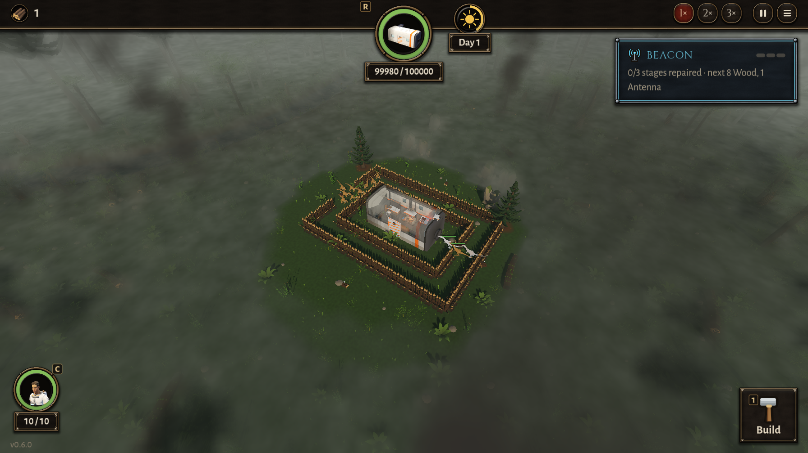

# BUG-025 走廊里排队的来袭一直站着，不算"卡住"：72 秒没一只咬墙，只有一只咬得到船舱

- 状态: open
- 严重度: 中（玩家第五轮报告的"大波在走廊里徘徊"，22743e4 的修在这个摆法下没起作用）
- 发现: 2026-09-29 · 22743e4（TASK-027 第 1 条）
- 复现: `DA_RAID=12 GODOT_PROJECT=$(bash debug-agent/tools/snapshot.sh 22743e4) bash debug-agent/tools/run_check.sh probe:corridor`

## 摆法（照设计书里玩家的描述）

船舱外两圈木栅栏：内圈离船舱 2 格、外圈 4 格，中间隔一格，是 1 米宽的走廊。外圈西头开 3 格，内圈东边缺 1 格，是来袭唯一的路。（外圈东北角那一格放不下，多了一个口子，不影响。）一波 12 只从巢里来，血加厚（不让船舱的炮打死）。



## 现象

| | 22743e4 | 改之前 f694865 |
|---|---|---|
| 第一只咬到船舱 | 18 s | 17 s |
| 同时咬船舱的 | 最多 1 只 | 最多 1 只 |
| 90 秒里咬栅栏 | **0 次**，75 段一段没少 | 0 次 |
| 抽搐报告 | 56（fidget 46）；重跑一次 23（fidget 17、mill 2） | 46（fidget 30） |

40 秒时每一只的状态（位置、念头、目标、`debug_state().jammed_for`、速度、分到的位置）：

```
(8.1,1.7)  ENGAGE ->core jam 0.65 v0.00 slot (5.85, 3.85)
(7.2,2.1)  ENGAGE ->core jam 1.05 v0.00 slot (6.0, 2.0)
(6.2,1.8)  ATTACK ->core jam 0.0  v0.00                 ← 唯一一只在咬船舱
(8.1,-2.1) ENGAGE ->core jam 1.83 v0.01 slot (4.0, 0.0)
(7.1,-1.9) ENGAGE ->core jam 1.9  v0.00 slot (5.0, 0.0)
(-4.1,-0.1) ENGAGE ->core jam 1.1 v0.00 slot (-2.0, 2.0)
... 共 11 只 ENGAGE，速度都是 0
```

11 只站了 20 多秒一动不动，可是 `jammed_for` 都只有 0.5～1.9 秒，到不了 `jam_seconds`（4 秒）。

## 猜的原因（读代码，没改）

`Dino._watch_for_a_jam`：

1. **目标一变就清零**：`_nav_goal` 挪了 `jam_progress × 2` 以上就当成新的路、`_jam_clock = 0`。排队的时候分到的位置（`assigned_slot`，都在内圈里、船舱边上那条 1 米的缝里）一直在重新分，目标跟着跳，钟每一两秒就被清零。
2. **要"顶着墙"**：到了 4 秒还要 `_building_pressed_against()` 不为空。排队的恐龙停在前一只后面一点（`queue_standoff`），不贴着栅栏，就算钟走满了也不会咬。

所以玩家那种"一整波在走廊里"，现在不再来回冲（速度 0），但变成了站着排队，一只一只进去咬，后面的一直等。

## 期望

排队、目标在一堵墙后面、很久没更近的，也算卡住：比如按"离船舱（最终目标）更近了没有"来算，而不是按一直在变的 slot；"顶着墙"放宽成"墙在它和目标之间、离它一两米以内"。
